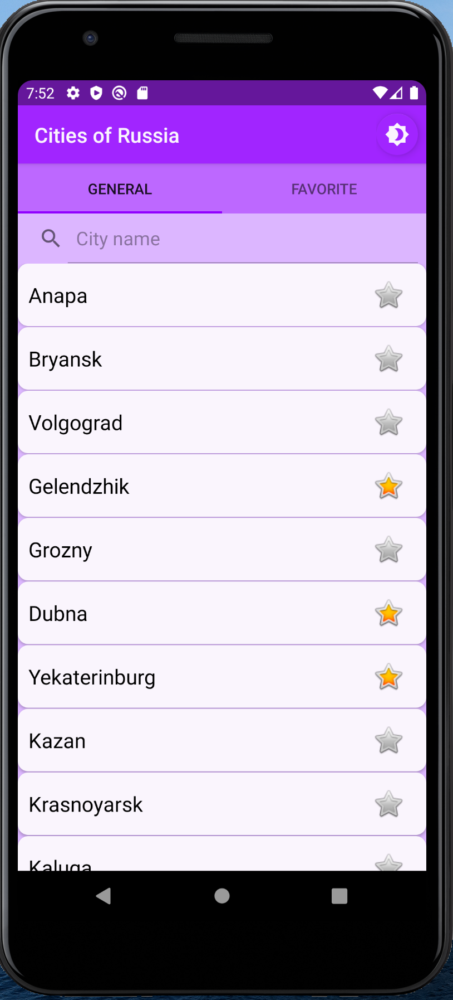
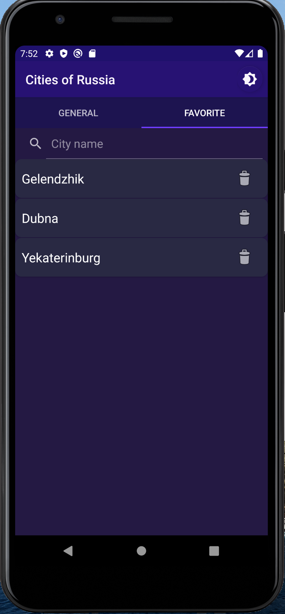

# Android-List-Search

- You can scroll cities lists
- For convenience, there is a search at the top of each list
- You can switch between main and favorite screens when you swipe
- You can manage the list of favorite cities by adding a city there (turn on the  by pressing), deleting the city from there (turn off the  by pressing or clicking on the  on the favorites screen)
- The app supports two themes (night / light), the switch is at the top (click on )
- The application also supports two languages of the system (Russian / English) (note: you cannot change the language inside the application itself)
- When you close the application, your favorite cities are saved

